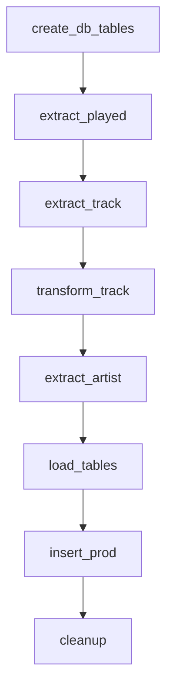

# spotify-listening-habits
*ETL-Pipeline to extract recently played tracks and corresponding artist info from spotify and load to a postgresql database using Prefect.*

## Task Overvierw & Database Schema
#### Tasks



#### ER Diagram of the final Database


## Prerequisites 
- Spotify Account
- A running PostgreSQL database named *spotify*

## Spotify API
To authorize with the Spotify API needs some preparations
1. Create an app in the Spotify Developers Dashboard ([spotify docs](https://developer.spotify.com/documentation/web-api/concepts/apps)) to retrieve your *Client ID* and *Client Secret* and set a *Redirect URI*
2. Assign the information to the environment variables *SPOTIPY_CLIENT_ID, SPOTIPY_CLIENT_SECRET, SPOTIPY_REDIRECT_URI* in ```.env``` 
3. Run ```token_init.py``` and follow the instructions. This will create an access token stored in ```dags/.cache```

## Prefect Setup
You can run the ETL flow locally or deploy it via Prefect Cloud / Prefect Server.

1. Install dependencies from `pyproject.toml`
```bash
uv sync
```

2. Prepare Variables

When you run Prefect cloud or self-hosted, specify the Variables via Blocks in the webui:
- spotify-postgresql (SQLAlchemy Connector): The connection to the spotify DB
- spotify-access-token (Secret): The cached token value
- spotipy (Secret, json format): SPOTIPY_CLIENT_ID, SPOTIPY_CLIENT_SECRET, SPOTIPY_REDIRECT_URI

When you run locally you have to create these blocks locally first (refer to the prefect [wiki](https://docs.prefect.io/v3/concepts/blocks#blocks))

3. Run the flow


## Notes
- The project replaces Airflow with Prefect for more flexible orchestration and simpler local development.
- Database schema remains unchanged.
- Tokens are cached locally and automatically refreshed by the flow when expired.
