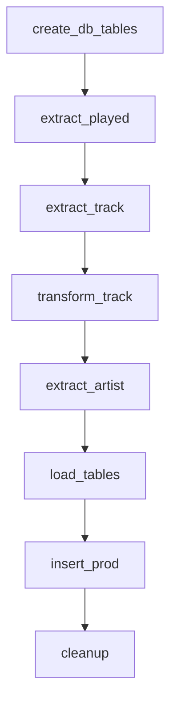

# spotify-listening-habits
*ETL-Pipeline to extract recently played tracks and corresponding artist info from spotify and load to a postgresql database using Prefect.*

## Task Overvierw & Database Schema
#### Tasks



#### ER Diagram of the final Database


## Prerequisites 
- Spotify Account
- PostgreSQL database

## Setup & Spotify API Integration

To get started, follow these steps in order:

1. **Install dependencies**  
   Install all required packages from `pyproject.toml`:
   ```bash
   uv sync
   ```

2. **Register a Spotify Developer App**  
   - Go to the [Spotify Developers Dashboard](https://developer.spotify.com/documentation/web-api/concepts/apps).
   - Create an app to retrieve your *Client ID*, *Client Secret*, and set a *Redirect URI*.

3. **Start Prefect Server (for local development)**  
   In a new terminal, start the Prefect server:
   ```bash
   prefect server start
   ```
   Update the prefect server url in `pyproject.toml` under `[tool.prefect]`

4. **Set Up Prefect Blocks for Credentials and Connections**  
   Run the provided script to interactively create all required Prefect blocks:
   ```bash
   uv run -m src.spotify_etl.prefect_blocks.create_blocks
   ```
   This script will:
   - Prompt for your Spotify API credentials and create the `spotipy` block.
   - Use Spotify OAuth with the credentials in the `spotipy` block to create `spotify-access-token` block.
   - Prompt for PostgreSQL connection details to create the `spotify-postgresql` block.

   > **Tip:** If you use Prefect Cloud or a self-hosted server, you can also create these blocks via the Prefect UI.

5. **Run the ETL Flow**  
   Once the blocks are created and Prefect is running, you can execute the ETL and analytics flows.
   ```bash
   uv run -m src.spotify_etl.flow
   uv run -m src.analytics.flow
   ```
   > **Tip:** For a more elaborate Prefect setup deploy the flows to your prefect instance (e.g. `prefect deploy` with the `prefect.yaml`) and set an automation to start the analytics flow after completing the ETL flow (see [PrefectDocs | Automations](https://docs.prefect.io/v3/concepts/automations)).
---

**Required Prefect Blocks:**
- `spotipy` (Secret, JSON): Spotify API credentials
- `spotify-access-token` (Secret): Spotify OAuth token
- `spotify-postgresql` (SQLAlchemy Connector): PostgreSQL connection

For more details on Prefect blocks, see the [Prefect documentation](https://docs.prefect.io/v3/concepts/blocks#blocks).